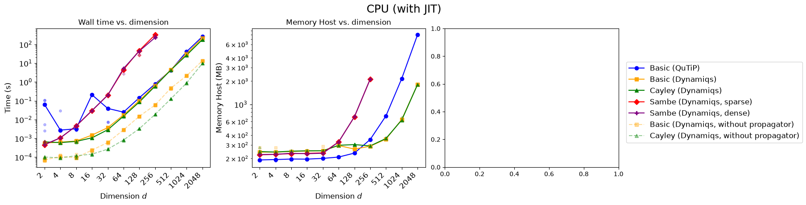
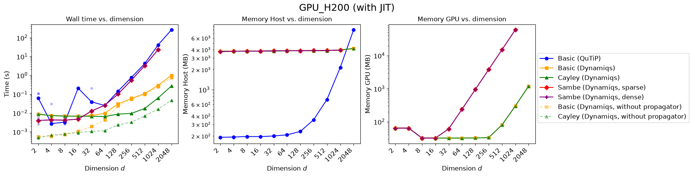
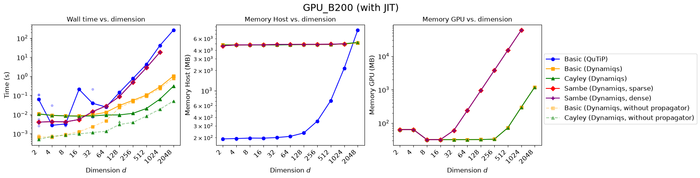
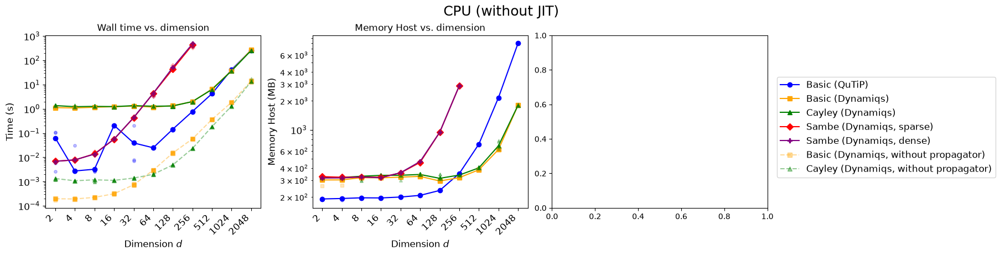
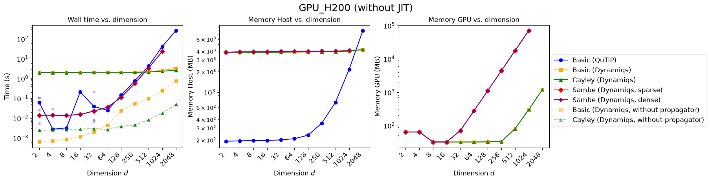

# Compare various solvers for floquet. 

## Install

1. Install `uv` locally. Instructions [https://docs.astral.sh/uv/getting-started/installation/](here). 
2. Clone this repo. Inside the directory run `uv init --name floquet_gpu` to install the necessary dependencies. 
3. The benchmarking shell scripts are straightforward to run (e.g. `./submit.sh`). This submits all the benchmarking scripts as a series of SLURM array jobs.
You might have to delete a whole bunch of output files.
4. To run a notebook, select the virtual environment `floquet_gpu`. 

## How it works:
1. The script solves the Floquet problem for a range of Hilbert space dimensions, with multiple trial runs per dimension. Here, each trial run defines a pair of random matrices, $H_0$ and $H_1$, and solves the Floquet problem for the Hamiltonian $H(t) = H_0 + A \cos (\omega_d t) H_1$. $H_0$ and $H_1$ are defined to be Hermitian matrices, with unit spectral norm. Importantly, since JAX uses pseudo-random generations, the same matrices can be generated across various solvers. This allows us to validate the computed Floquet modes and quasienergies, with a reliable solver (named "basic" here), such as qutip. 

2. Running `./submit.sh` first runs a set of "basic" jobs. This should be the code that you can rely on the most; i.e. your source of truth. Currently this is set up to solve the Floquet problem using QuTiP, on the CPU. 

3. Then, it runs all the non-basic jobs on all the specified devices, with a nested loop. For the JAX-based solvers, both the uncompiled version and JIT-compiled versions are benchmarked. 

4. Once all the jobs on the same device (but for different solvers) are complete, `consolidate.py` can merge all the data collected on that device into a single `.npy` file. Note that sometimes jobs may fail. This may if they exceed the time-limit (currently set to 30mins), the allotted CPU memory (currently 10GB) or the GPU memory (currently 5GB). `consolidate.py` ignores any failed job. The script reports how many jobs were found, for each solver, in its output. 

5. Once all the jobs have completed and consolidated, you may delete their corresponding directories `out/[solver]/`. The consolidated outputs will be saved to `out/[solver].npy`, for each solver. These may be plotted, as demonstrated in the notebook `out/plot.ipynb`.  

## Some choices I made:

1. Each trial is run as a seperate job. I was worried that if multiple trials are run within the same job, they may occupy memory and slow down future trials. 

2. The quasienergies and Floquet modes are post-processed, to match the conventional branch analysis.

3. Memory is not measured within `bench_solvers.py` but in `benchmark.py`. This is because the we must also measure the memory allocated when `H_0` and `H_1` are created. 

4. For all the JAX-based solvers (regardless of JIT), the solver is "warmed-up" with a single run. This triggers any compilation defined in my code, as well as any hidden compilation, defined by `dynamiqs`. I'm not sure if this is the best decision, but you should keep this in mind while interpreting the results.

## Results:

It is most insightful to compare the results after JIT, on a CPU and the Hopper H200 GPU. You may look at the complete set of results in the [`out/plot.ipynb`](out/plot.ipynb) notebook. 

Some key insights: 
1. On a CPU, Dynamiqs is always as fast (or sometimes slightly faster) than QuTiP. On the GPU it is significantly faster
2. On a CPU, Dynamiqs also consumes a lot less memory than QuTiP. However, on a GPU, Dynamiqs imposes a significant memory overhead on the host, presumably for storing the CUDA-context. This host-memory load is independent of the problem's dimension size. 
3. On the GPU, for large dimensions, the Cayley transformation wins over the naive diagonalization of the propagator. On a CPU, these methods are comparable. 
4. The Sambe/Shirley-space solver is always solver than the propagator-based solvers, and scales very poorly with distance. It also consumes a lot of memory. Therefore, it never offers a benefit. 
5. The runtime and memory consumption is similar on the Hopper (H200) and Blackwell (B200) GPUs, as shown below. 

6. For smaller dimensions, JIT noticeably improves the wall clock time (by several orders of magnitude). 
For larger dimensions, the actual computational time dominates, and the improvement is not as noticeable. 
This is true on both, CPU and GPU. 

7. The results from all methods match, up to numerical precision. I haven't included the comparison here, but you may take a look in the [`out/plot.ipynb`](out/plot.ipynb) notebook. 

## Caution:
`.submit.sh` is written by Claude! So please don't blame Harsh if your computer blows up. 